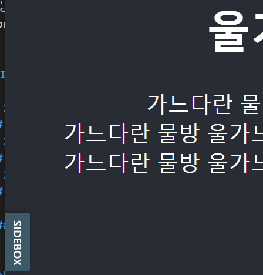
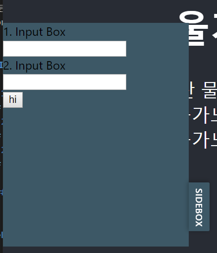

# 
Front Design Collection

재사용 가능한 의존성 없는 Component들로 이루어진 Front Design Collection입니다.

- - - 
#### 📂 Index

> ###### 1. [SideBar](#SideBar)
>> ######   1-1 GraphQL SideBar
> ###### 2. [Timer](#Timer)
>> ######   2-1 Absolute Bottom Timer
> ###### 3. [Footer](#Footer)
>> ######   3-1 Black Footer
> ###### 4. [읽을 거리](#읽을-거리)
>>  ######  - [____](#____)
- - -
 

#### SideBar
 

- **GraphQL SideBar**

 

#### Timer
 

- **Absolute Bottom Timer**

 

#### Footer
 

- **Black Footer**

#### 읽을 거리